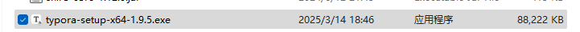
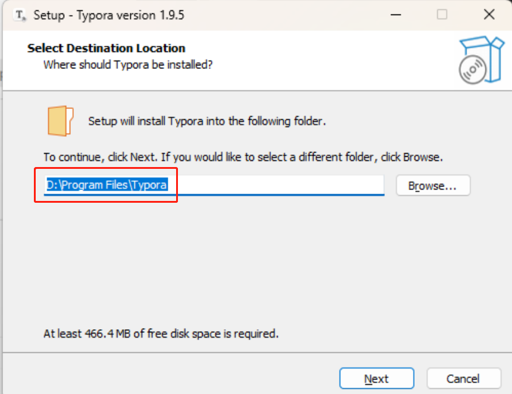
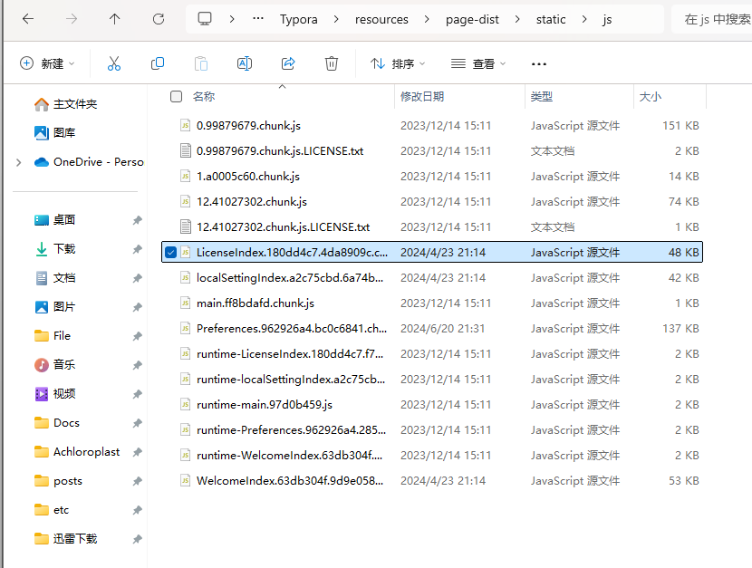
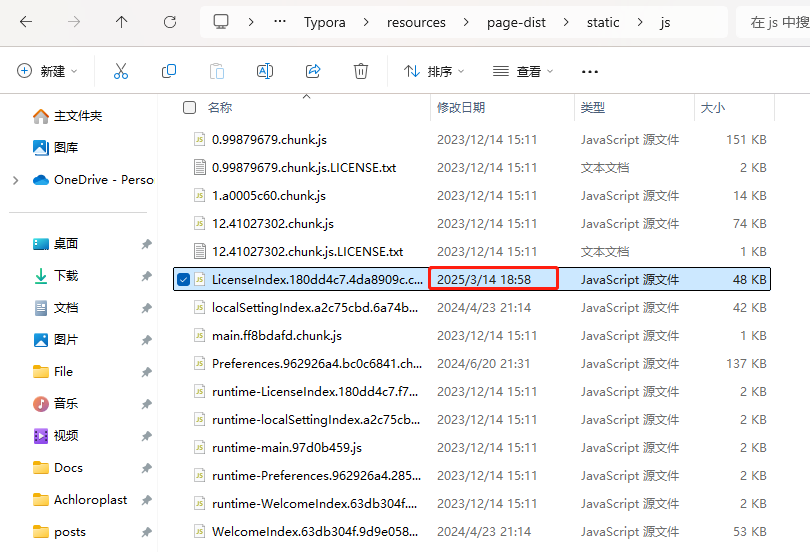
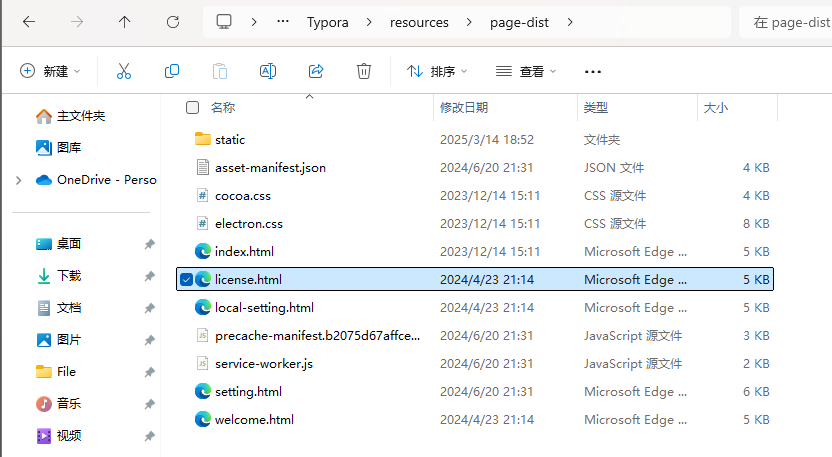
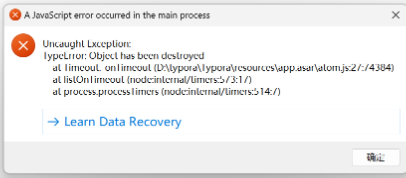

一、官网下载
https://www.typoraio.cn/

ps:注意下载1.9.5版本或之前的版本，新版会闪退
二、傻瓜式安装

注意安装地址，以及可以勾选桌面快捷图标

三、使用Typora
1.在安装路径下找到js文件
`D:\Program Files\Typora\resources\page-dist\static\js`

右键使用文本打开。

然后ctrl+f查找：`e.hasActivated="true"==e.hasActivated`替换为`e.hasActivated="true"=="true"`，并保存，如果保存成功，那么修改时间会改变。

此时打开就可以成功打开了。但是还会提示弹窗提示需要输入许可证激活，接下来我们继续操作。

2.在下面的路径中进行操作
`D:\Program Files\Typora\resources\page-dist`
打开`license.html`文件，查找`</body></html>`替换为`</body></html>`后保存

3.然后去这个路径下面找到对应的代码
`D:\Program Files\Typora\resources\locales\zh-Hans.lproj`
打开`json`文件，将`"UNREGISTERED":"未激活"`替换为`"UNREGISTERED":" "`

4.再次打开Typroa就可以直接使用了

5.ps：如果提示的有报错，我们只需要点击`Learn Data Recovery`就行，这样会跳出一个页面，关掉跳出页面，后面我们就可以正常使用typora了。

<!--more-->

The remaining content of your post.
